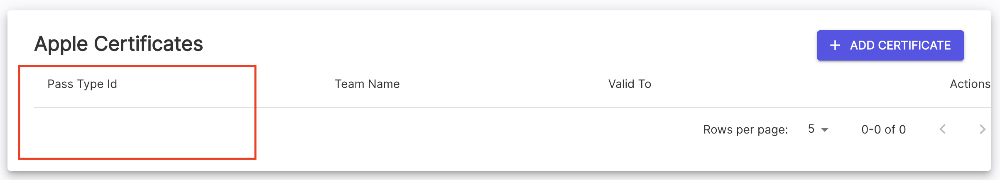
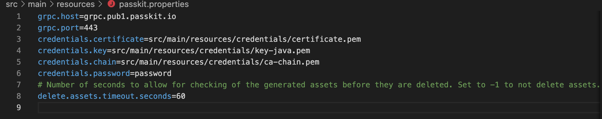
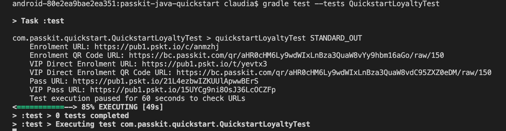

# PassKit Java Quickstart

[](https://opensource.org/licenses/MIT)
[](https://search.maven.org/artifact/com.passkit.grpc/sdk)

## Overview

Create and manage Apple Wallet and Google Wallet membership cards, coupons, event tickets, and boarding passes with the PassKit Java gRPC SDK.

Each guided workflow creates a complete set of sample assets and cleans them up afterward. The shared `PassKitApi` exposes every generated SDK service, including membership, coupons, event tickets, flights, templates, images, distribution, messages, analytics, integrations, users, certificates, scheduler, and raw operations.

## Prerequisites

You will need the following:

- A PassKit account (signup for free at https://app.passkit.com)
- Your PassKit SDK Credentials (available from the https://app.passkit.com/app/account/developer-tools)
- Java 11 or newer (Java 21 is used in CI)
- Apple wallet certificate id (for flights only, https://app.passkit.com/app/account/certificates)
 

## Setup

You do not need to install Gradle; this repository includes the Gradle wrapper.

1. Copy `.env.example` to `.env`.
2. Create `src/main/resources/credentials` and add `certificate.pem`, `ca-chain.pem`, and `key-java.pem`.
3. Fill in your credential password and other values in `.env`. For flights, set `PASSKIT_APPLE_CERTIFICATE_ID`.

The Java SDK uses the Java-compatible private key (`key-java.pem`). Keep `.env` and all PEM files private; they are excluded by `.gitignore`.

Environment variables and `.env` take precedence over the backward-compatible `src/main/resources/passkit.properties` defaults. European accounts use `grpc.pub1.passkit.io`; US accounts should set `PASSKIT_GRPC_HOST=grpc.pub2.passkit.io`.

<details>
<summary>Legacy passkit.properties setup</summary>

1. Download or clone this quickstart repository, create a folder `credentials` in the resources folder of the repository and add the following three PassKit credential files:
    - certificate.pem
    - ca-chain.pem
    - key-java.pem
    
    You can disregard the key.pem credentials file as it is not compatible with Java.

2. Edit `passkit.properties` in the resources folder 
    - set `credentials.password` to the password that you set when requesting your SDK credentials from https://app.passkit.com
    - if you are using flights edit `credentials.appleCertificate` with your id
    - check the API region of your account [here](https://app.passkit.com/app/account/developer-tools) and change it accordingly, for Europe/Pub1 use `grpc.host = "grpc.pub1.passkit.io"` and for USA/Pub2 use `grpc.host = "grpc.pub2.passkit.io"`.
    - If you wish to receive enrollment emails for loyalty or coupon cards edit `baseEmail` and `vipEmail`
    - set other options as required
    

</details>

## Run a complete workflow

```bash
./gradlew run --args='membership'
./gradlew run --args='coupons'
./gradlew run --args='event-tickets'
./gradlew run --args='flights'
```

The runner uses a four-channel round-robin pool by default. Change `PASSKIT_POOL_SIZE` if needed. Set `PASSKIT_CLEANUP_DELAY_SECONDS` to a positive number to inspect generated passes before cleanup, or `-1` to retain them.
    

    
## Tests

Run fast local tests (live API tests are skipped):

```bash
./gradlew test
```

After configuring credentials, run all live workflow tests with:

```bash
PASSKIT_RUN_LIVE_TESTS=true ./gradlew test
```

Run `gradle test --tests QuickstartLoyaltyTest` or `gradle test --tests QuickstartEventTicketsTest` or `gradle test --tests QuickstartCouponsTest` or `gradle test --tests QuickstartFlightTicketsTest` in the terminal.

The Loyalty tests will create a membership program with 2 tiers, base and VIP.  It will enrol two members, one in each tier.
The Event Tickets tests will create a venue, production, and event with 2 ticket types and create 2 tickets with the same order number.

The Coupons tests will create a campaign with 2 offers, base and VIP. It will create two coupons, one in each offer. It will then redeem one of the coupons and list the other.

The Flights Tickets tests will create a carrier, flight, an arrival airport, a departure airport, flight designator and boarding pass for one person. 

The tests will display URLs to the generated passes and to the enrolment page.  It will pause for a period determined in `passkit.properties` for you to check them.

The tests will then delete and clean-up all assets that it created.
An example of what this would look like in the terminal is shown below:

 

## Shared API

```java
try (PassKitApi api = new PassKitApi()) {
    var loyalty = api.loyalty();
    var coupons = api.coupons();
    var events = api.eventTickets();
    var flights = api.flights();
}
```

The domain facades use the same curated method names as the other PassKit quickstarts. For example, call `api.loyalty().createProgram(request)`, `api.coupons().createCoupon(request)`, or `api.flights().createBoardingPass(request)`. Java-specific adapters combine blocking calls with coupon and raw update streams.

Potentially destructive bulk operations require an explicit opt-in:

```java
try (PassKitApi api = new PassKitApi(true)) {
    api.advanced().loyalty().bulkDeleteMembers(request);
}
```

The parity test verifies the membership, coupons, event tickets, flights, templates, images, analytics, distribution, integrations, scanners, certificates, and raw method surfaces against the shared quickstart API. The underlying typed SDK stubs remain available through compatibility accessors such as `members()`, `couponsStub()`, `rawStub()`, and `users()`.

## Documentation
* [PassKit Membership Official Documentation](https://docs.passkit.io/protocols/member)
* [PassKit Coupons Official Documentation](https://docs.passkit.io/protocols/coupon)
* [PassKit Boarding Passes Official Documentation](https://docs.passkit.io/protocols/boarding)
* [PassKit Events Official Documentation](https://docs.passkit.io/protocols/event-tickets/)

## Licence

MIT — see [LICENSE](LICENSE).
