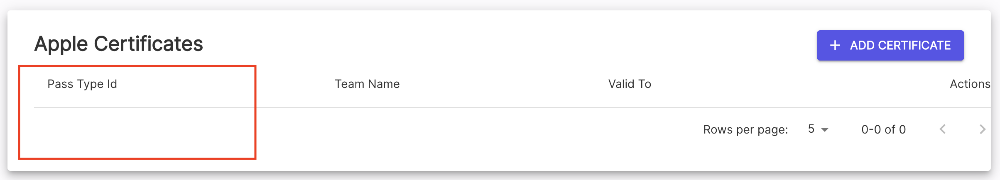
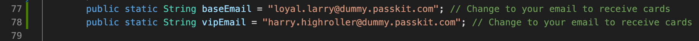

PassKit Java Quickstart
=======================

### Overview

This quickstart aims to help  get Java developers up and running with the PassKit SDK as quickly as possible.

### Prerequisites

You will need the following:

- A PassKit account (signup for free at https://app.passkit.com)
- Your PassKit SDK Credentials (available from the https://app.passkit.com/app/account/developer-tools)
- Java JDK 8 or above (11.0.9LTS recommended) from https://www.oracle.com/java/technologies/downloads/ (https://docs.oracle.com/en/java/javase/18/install/overview-jdk-installation.html - guide on how to download)
- Gradle Build Tool from https://gradle.org/install/ with guide on how to install
- Apple wallet certificate id (for flights only, https://app.passkit.com/app/account/certificates)
 

### Configuration

1. Download or clone this quickstart repository, create a folder `credentials` in the resources folder of the repository and add the following three PassKit credential files:
    - certificate.pem
    - ca-chain.pem
    - key-java.pem
    
    You can disregard the key.pem credentials file as it is not compatible with Java.

2. Edit `passkit.properties` in the resources folder 
    - set `credentials.password` to the password that you set when requesting your SDK credentials from https://app.passkit.com
    - if you are using flights edit `credentials.appleCertificate` with your id
    - check the API region of your account [here](https://app.passkit.com/app/account/developer-tools) and change it accordingly, for Europe/Pub1 use `grpc.host = "grpc.pub1.passkit.io"` and for USA/Pub2 use `grpc.host = "grpc.pub2.passkit.io"`.
    - set other options as required
    

3. If you wish to receive enrollment emails for loyalty or coupon cards edit `baseEmail` and `vipEmail` on lines 77 and 78 in QuickstartLoyalty for loyalty,
    
    and lines 70 and 71 in QuickstartCoupons for coupons.
    

4. If you are using flights edit `appleCertificate` on line 59 
    
    

    
### Running the tests

Run `gradle test --tests QuickstartLoyaltyTest` or `gradle test --tests QuickstartLEventTicketsTest` or `gradle test --tests QuickstartCouponsTest` or `gradle test --tests QuickstartFlightTicketsTest` in the terminal.

The Loyalty tests will create a membership program with 2 tiers, base and VIP.  It will enrol two members, one in each tier.
The Event Tickets tests will create a venue, production, and event with 2 ticket types and create 2 tickets with the same order number.

The Coupons tests will create a campaign with 2 offers, base and VIP. It will create two coupons, one in each offer. It will then redeem one of the coupons and list the other.

The Flights Tickets tests will create a carrier, flight, an arrival airport, a departure airport, flight designator and boarding pass for one person. 

The tests will display URLs to the generated passes and to the enrolment page.  It will pause for a period determined in `passkit.properties` for you to check them.

The tests will then delete and clean-up all assets that it created.
An example of what this would look like in the terminal is shown below:

 

## Documentation
* [PassKit Membership Official Documentation](https://docs.passkit.io/protocols/member)
* [PassKit Coupons Official Documentation](https://docs.passkit.io/protocols/coupon)
* [PassKit Boarding Passes Official Documentation](https://docs.passkit.io/protocols/boarding)
* [PassKit Events Official Documentation](https://docs.passkit.io/protocols/event-tickets/)

### Notes

For implementing in your own projects, use the GrpcConnection class to manage connection to the PassKit gRPC endpoints.

Use the GrpcConnection's ManagedChannel object to create the stubs you require in your implementation. 

